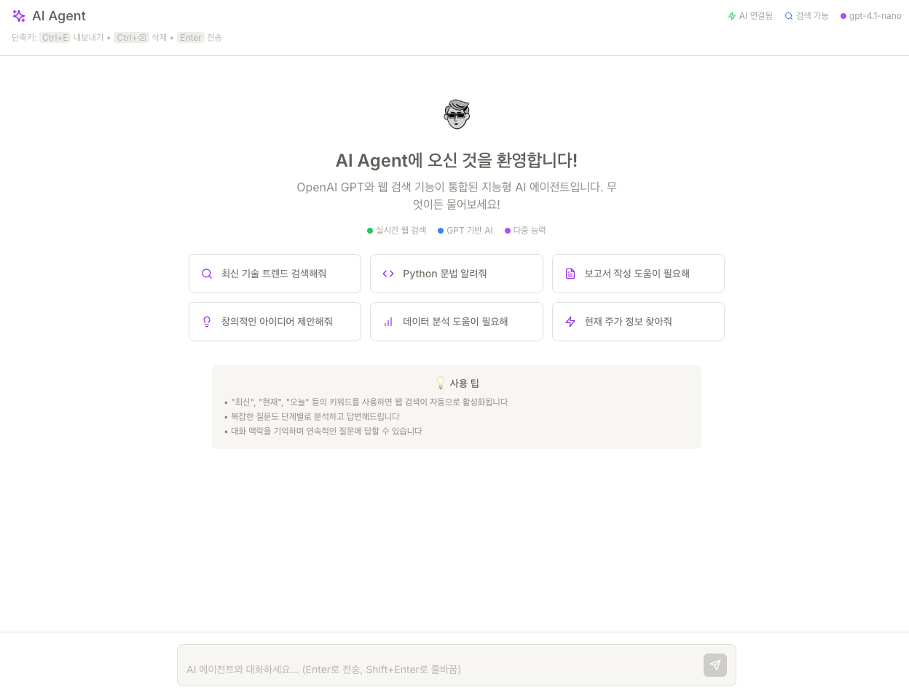

# AI Agent 🤖



OpenAI GPT와 실시간 웹 검색이 통합된 차세대 AI 어시스턴트입니다. Notion AI 스타일의 세련된 UI와 강력한 기능을 제공합니다.

## ✨ 주요 기능

### 🧠 AI 기반 대화
- **OpenAI GPT 모델 지원** - 환경변수로 모델 선택 가능 (GPT-3.5-turbo, GPT-4 등)
- **맥락 기억** - 이전 대화 내용을 기억하며 자연스러운 연속 대화
- **의도 감지** - 사용자 질문의 유형을 자동으로 분석하고 적절한 응답 제공

### 🔍 실시간 웹 검색
- **Tavily Search API 통합** - 최신 정보 자동 검색
- **키워드 자동 감지** - "최신", "현재", "오늘" 등의 키워드 감지 시 자동 검색
- **검색 결과 통합** - AI 응답에 실시간 웹 검색 결과 반영

### 🎯 전문 분야 지원
- 📊 **데이터 분석** - 차트, 그래프, 통계 분석
- 💻 **코딩 도우미** - 프로그래밍 문제 해결, 코드 리뷰
- ✍️ **글쓰기 지원** - 보고서, 에세이, 블로그 작성
- 💡 **아이디어 생성** - 창의적 브레인스토밍
- 🔍 **웹 검색** - 실시간 정보 수집

### 💾 데이터 관리
- **자동 저장** - LocalStorage를 통한 대화 내역 영구 보존
- **대화 내보내기** - JSON 형식으로 대화 내역 다운로드
- **안전한 삭제** - 확인 단계를 거친 대화 내역 삭제

### ⌨️ 사용성
- **키보드 단축키** - Ctrl+E (내보내기), Ctrl+Backspace (삭제)
- **메시지 복사** - 개별 메시지 클릭으로 클립보드 복사
- **반응형 디자인** - 모든 디바이스에서 최적화된 경험

## 🚀 시작하기

### 1. 프로젝트 클론
```bash
git clone https://github.com/yourusername/ai_agent.git
cd ai_agent
```

### 2. 의존성 설치
```bash
npm install
```

### 3. 환경변수 설정
`.env` 파일을 생성하고 다음 내용을 추가하세요:

```env
REACT_APP_OPENAI_API_KEY=your_openai_api_key_here
REACT_APP_TAVILY_API_KEY=your_tavily_api_key_here
REACT_APP_LLM_MODEL=gpt-3.5-turbo
```

#### API 키 발급 방법:
- **OpenAI API**: https://platform.openai.com/api-keys
- **Tavily Search API**: https://tavily.com/

### 4. 개발 서버 실행
```bash
npm start
```

브라우저에서 `http://localhost:3000`으로 접속하세요.

## 🎨 UI 특징

### 모던한 디자인
- **글래스모피즘** - 반투명 배경과 블러 효과
- **그라데이션** - 아름다운 색상 전환
- **마이크로 애니메이션** - 부드러운 사용자 경험

### 색상 시스템
- 각 기능별 전용 색상 테마
- 접근성을 고려한 대비율
- 다크/라이트 모드 대응 준비

### 반응형 레이아웃
- 모바일, 태블릿, 데스크톱 최적화
- 유연한 그리드 시스템
- 터치 친화적 인터페이스

## 📁 프로젝트 구조

```
ai_agent/
├── public/
│   └── index.html
├── src/
│   ├── components/          # React 컴포넌트
│   │   ├── ChatBot.tsx     # 메인 채팅 인터페이스
│   │   ├── MessageBubble.tsx # 메시지 버블
│   │   ├── TypingIndicator.tsx # 타이핑 표시
│   │   ├── WelcomeMessage.tsx # 환영 화면
│   │   └── AIAgent.ts      # AI 에이전트 로직
│   ├── hooks/              # Custom React Hooks
│   │   └── useKeyboardShortcuts.ts
│   ├── services/           # 외부 서비스 연동
│   │   ├── apiService.ts   # OpenAI/Tavily API
│   │   └── storageService.ts # 로컬 저장소
│   ├── types.ts           # TypeScript 타입 정의
│   ├── index.css         # 글로벌 스타일
│   ├── index.tsx         # 앱 진입점
│   └── App.tsx          # 메인 앱 컴포넌트
├── .env                 # 환경변수 (git에서 제외)
├── package.json
└── README.md
```

## 🔧 기술 스택

### Frontend
- **React 18** - 최신 React 기능 활용
- **TypeScript** - 타입 안전성 보장
- **Tailwind CSS** - 유틸리티 기반 스타일링
- **Lucide React** - 아이콘 라이브러리

### APIs & Services
- **OpenAI API** - GPT 모델 활용
- **Tavily Search API** - 실시간 웹 검색
- **LocalStorage** - 클라이언트 데이터 저장

### 개발 도구
- **Create React App** - 프로젝트 부트스트래핑
- **ESLint** - 코드 품질 관리
- **PostCSS** - CSS 후처리

## 🎯 사용법

### 기본 대화
1. 하단 입력창에 질문을 입력하세요
2. Enter를 눌러 메시지를 전송하세요
3. AI가 맥락을 고려한 답변을 제공합니다

### 웹 검색 활용
다음 키워드를 포함하면 자동으로 최신 정보를 검색합니다:
- "최신", "현재", "오늘", "2025", "실시간"
- "뉴스", "트렌드", "업데이트", "정보"

### 키보드 단축키
- `Enter`: 메시지 전송
- `Shift + Enter`: 줄바꿈
- `Ctrl + E`: 대화 내역 내보내기
- `Ctrl + Backspace`: 대화 내역 삭제

### 전문 분야 활용
질문에 다음 키워드를 포함하여 전문적인 답변을 받으세요:
- **코딩**: "코드", "프로그래밍", "개발", "버그"
- **데이터**: "분석", "차트", "통계", "시각화"
- **글쓰기**: "작성", "에세이", "보고서", "번역"
- **아이디어**: "브레인스토밍", "창의", "혁신"

## 🔒 보안 고려사항

- API 키는 환경변수로만 관리
- `.env` 파일은 Git에서 자동 제외
- 클라이언트 사이드 API 호출 시 키 노출 주의
- 민감한 정보는 대화에 포함하지 않는 것을 권장

## 🤝 기여하기

1. 이 저장소를 Fork하세요
2. 새 브랜치를 생성하세요 (`git checkout -b feature/amazing-feature`)
3. 변경사항을 커밋하세요 (`git commit -m 'Add some amazing feature'`)
4. 브랜치에 Push하세요 (`git push origin feature/amazing-feature`)
5. Pull Request를 생성하세요

## 📝 라이센스

이 프로젝트는 MIT 라이센스 하에 배포됩니다. 자세한 내용은 `LICENSE` 파일을 참조하세요.

## 📞 문의 및 지원

- 버그 리포트: GitHub Issues를 이용해주세요
- 기능 제안: Discussions 탭을 활용해주세요
- 이메일: your-email@example.com

## 🏆 업데이트 로그

### v1.0.0 (2025-09-23)
- ✨ OpenAI GPT 모델 통합
- 🔍 Tavily 웹 검색 API 연동
- 🎨 Notion 스타일 UI 구현
- 💾 로컬 저장소 기능
- ⌨️ 키보드 단축키 지원
- 📱 반응형 디자인
- 🌟 글래스모피즘 적용

---

⭐ 이 프로젝트가 유용했다면 Star를 눌러주세요!
